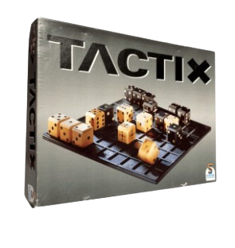
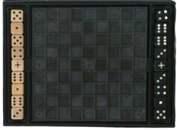
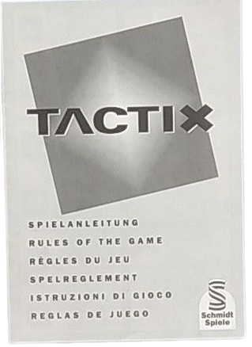
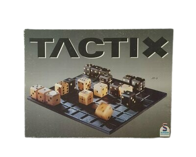

# SoftwareProject

Ein Repository für unsere Ideen und Projekte rund um das Spiel **Tactix**.

---

##  Tactix

**Mit Taktik und Strategie zum Sieg!**

<p align="center">
  
</p>


 [Zum Spiel](https://secondhandgame.de/Schmidt-Tactix-49043/D31-001)


<details>
<summary><strong>Aufbau</strong></summary>

### Tactix ist eine Schachvariante, die mit Würfeln auf einem 9×9-Brett gespielt wird.
  

<p align="center">
  
</p>


- 9 Würfel pro Spieler
- Königswürfel mit nur Einsern
- Ziehen durch Kippen der Würfel

</details>

<details>
<summary><strong>Download</strong></summary>

##  Download & Installation

```bash
git clone https://github.com/Ovilli/SoftwareProject.git
cd SoftwareProject
```

</details>

<details>
<summary><strong>Spielanleitung</strong></summary>

<p align="center">
  
</p>


</details>


<p align="center">
  
</p>

**Danke für Durchlesen**

----